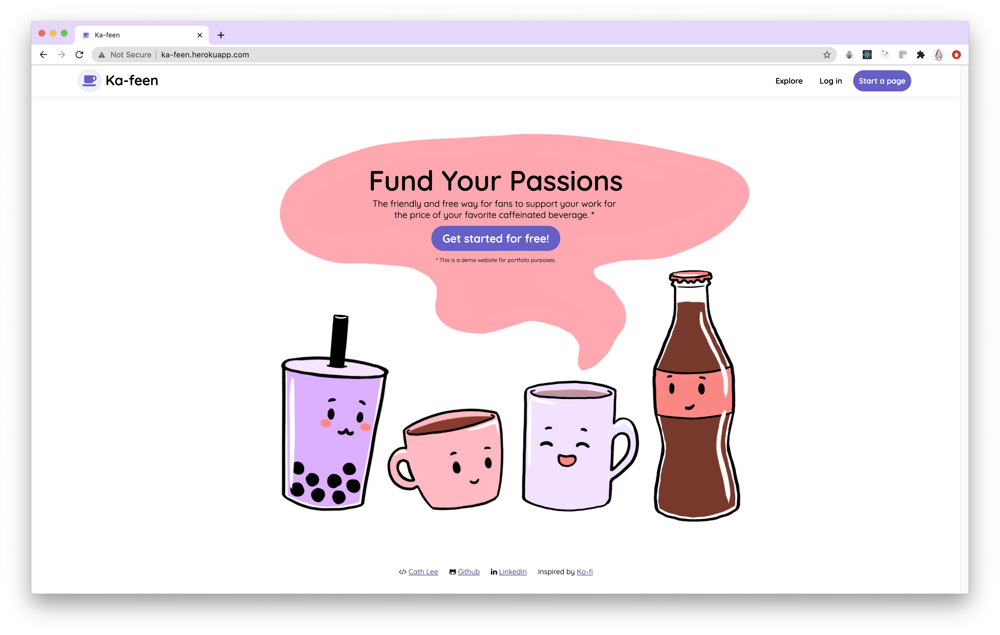
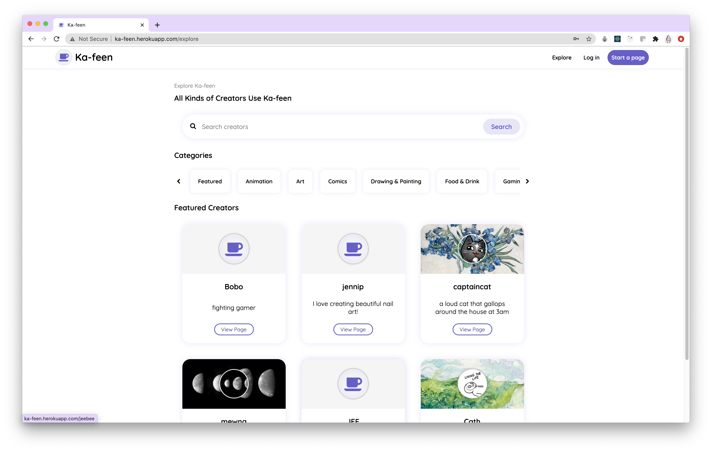
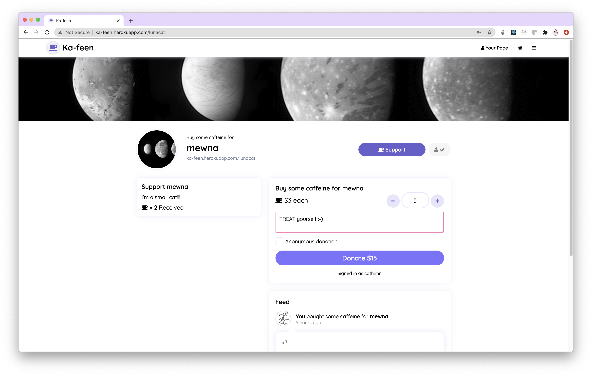

# Ka-feen

Inspired by Ko-fi, Ka-feen allows users to support their favorite independent creators for the price of their favorite caffeinated beverage.

[Live Demo](http://ka-feen.herokuapp.com/)

## Feature List

- Customizable profiles with AWS image hosting through AWS SDK Boto3
- Follow and search for other users by name or tags, organized in database using Flask SQLAlchemy for ORM
- User can make and delete posts with text and images that other users can like!
- Allow "donations" with messages and allow for anonymized donations
- Track "donations" received/given and amounts

## Screenshots

> Fully customized CSS and React components with custom modals and slide in menu controlled with React Context

> Explore page to find new accounts to follow or support, customizable profile pictures and banners through AWS S3

> Users can go to their profile to publish new posts or edit their display picture, features a lazy loading feed of posts and support history

> Users can visit "creator" profiles and support them with a kind message!
